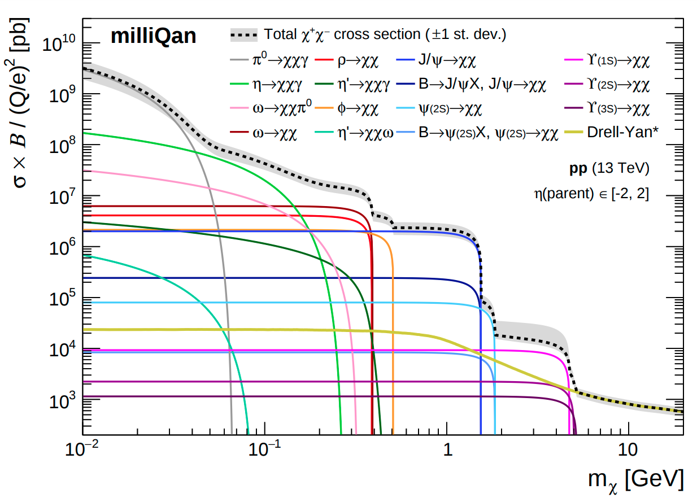

## milliq_mcgen

A collection of tools for generating signal Monte Carlo for the milliQan experiment:
* Compute cross sections and branching ratios for all mCP production modes
* Simulate both two-body and Dalitz decays of parent particles into mCP's
* Generate root files with all relevant information needed to feed generated mCP's into propagation/simulation software

**NOTE:** A master milliQan MC tutorial, from initial event generation all the way through pulse injection, [can be found here](docs/MASTER_TUTORIAL.md).

### Contents of subdirectories:

`decayMCP`: Main program to generate mCP decays (non-Drell-Yan)

`madgraphDY`: contains the MadGraph model and scripts to generate events for DY production of mCPs

`docs`: Documentation

`oniaDirect`: Various tools/data for direct onia production

`oniaFromB`: Theoretical distributions of onia from b decays

`mesonPt`: pT distributions for direct production of non-onia mesons (pi, rho, omega, phi, eta)

`scripts`: scripts to calculate Dalitz and Onia BR, perform two-body and Dalitz decays, and extract/plot mCP cross sections

`utils`: helper C++ functions to compute branching ratios and decay kinematics

`propagate`: script to propagate generated mCP's through the CMS environment with the [MilliqanSim](https://github.com/claudiocc1/MilliqanSim) package

`muons`: data and utilities for SM muon production (QCD, W, Z)
